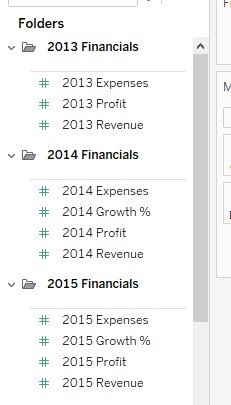

# 1000-Startups
Data Analysis Project

## Project Overview
This data analysis project provides insights to venture capital fund in analysing over 1000 new startups to make investment. 
The criterion for selecting investments for this fund is combination of:
1. High Revenue
2. Low Expense
3. Top Growth

## Data Sources
The primary dataset used for this analysis is the csv file, containing two sheets Financials and Overview information about 1000 startups.

## Tools
1. Tableau

## Data Cleaning/Preparation
In the initial data preparation phase, I performed the following tasks:

- Data loading and inspection
  - The two sheets in the csv file, Financials and Overview are connected to each other using inner join in tableau.
- Handling missing values.
  - No missing data
- Data cleaning and formatting
  - Duplicate columns ID and Name removed.
  - Created folders to group 2013,2014 & 2015 columns together.

    

## Exploratory Data Analysis
### 1. Number of companies founded each year
Following bar chart shows number of companies founded in each year from 1999-2014

We can group few of the previous years data(1999-2009 here)together using group function in the tableau.

### 2. Average number of employees in each industry

### 3. Top 10 startups by growth %
It is created using the static set so the top 10 startups won't change as the data changes. Also, if we want to see top 5 or top 20 startups then we need to make changes to see the required number of startups. To solve this problem, we can using dynamic set.

### 4. 2015 Revenue vs. 2015 Expenses
Scatterplot

Highlighted companies having higher revenue(>$9M). Value is dynamic and can be changed.

Highlighted companies having lower expenses(<$5M). Value is dynamic and can be changed.

Highlighted companies having higher revenue(>$9M) and lower expenses(<$5M). The Y-axis is reversed so that the quadrant is on right top side.

### Tableau Functions Used:
1. Groups
2. Sets (Static & Dynamic)
  
